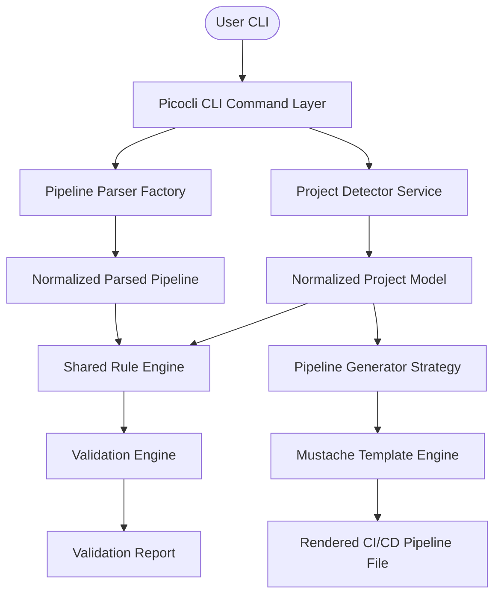
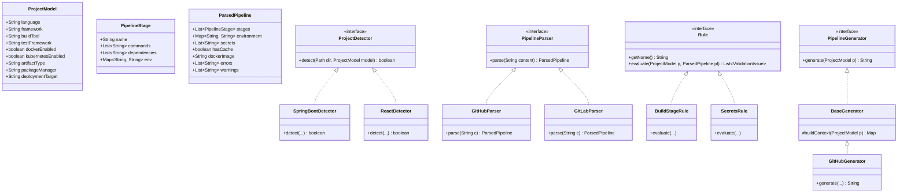
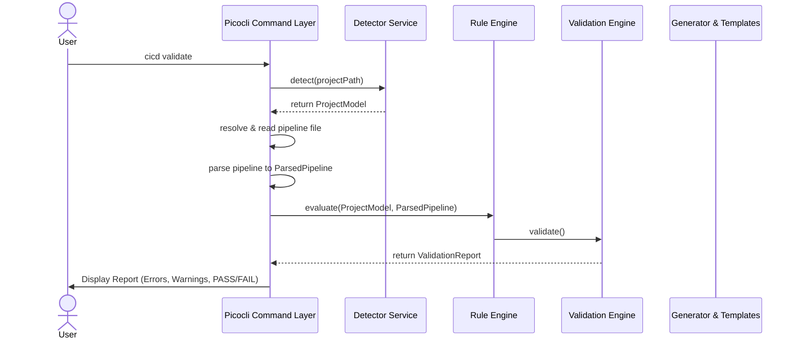
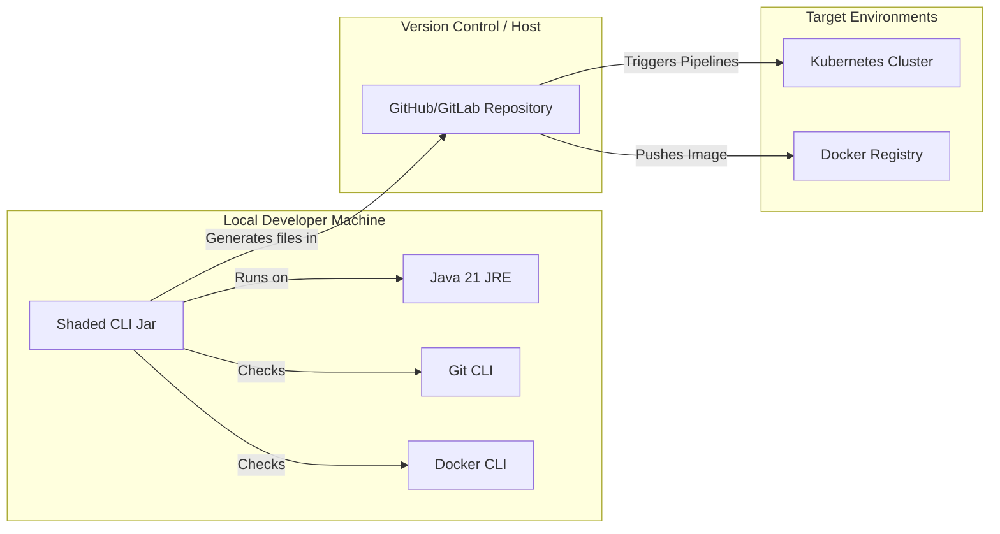

# Universal CI/CD Pipeline Validator and Generator CLI (`cicd`)

A cross-platform command-line tool built on **Java 21** that automatically scans codebases, parses existing CI/CD configurations, evaluates them against a shared rule engine, outputs quality reports, translates workflows between CI/CD platforms, and checks local system toolchain health.

---

## 🏗️ Architecture



### System Diagrams

#### 1. Class Diagram



#### 2. Sequence Diagram (Internal Data Flow)



#### 3. Deployment Diagram



---

## ⚡ CLI Features and Command Guide

The application supports the following commands:

### `cicd init`
Initializes a new `.cicd-config.json` configuration file with metadata in the target directory.
```bash
$ cicd init
Initialized successfully!
Config created at: /path/to/project/.cicd-config.json
```

### `cicd detect`
Scans the codebase stack (e.g. Maven, Spring Boot, React, Django) and normalizes it.
```bash
$ cicd detect
Scanning project...

Framework: Spring Boot
Language: Java
Build Tool: Maven
Testing Framework: JUnit
Docker: Found
Kubernetes: Not Found
Deployment Target: Docker
CI Platform: GitHub Actions (recommended)

Done.
```

### `cicd validate`
Validates a pipeline configuration file against codebase requirements.
```bash
$ cicd validate -f .github/workflows/main.yml
Validating pipeline file: /path/to/main.yml...

Validation Report

WARNING
  - Build stage has commands, but none contain expected keyword: 'mvn' for build system Maven.
  - Project outputs artifact type: 'JAR', but no artifact archiving step was detected.

INFO
  - Docker containerization detected and integration stage configured.
  - Referenced 4 unique pipeline secret(s) securely.

Overall Status: PASSED
```

### `cicd generate <platform>`
Generates a highly-optimized, secure pipeline for a target environment (`github`, `gitlab`, `jenkins`, `azure`).
```bash
$ cicd generate github -d . -w
Success: Pipeline generated and saved to: .github/workflows/main.yml
```

### `cicd explain`
Provides a step-by-step description of the execution flow, estimated runtime, and concurrency.
```bash
$ cicd explain -f .github/workflows/main.yml
Pipeline
↓
install-dependencies
↓
test
↓
docker-build
↓
deploy

Estimated Runtime
6 min

Parallel Jobs
1
```

### `cicd convert <source> <target> [file]`
Translates a pipeline from a source platform configuration format to another.
```bash
$ cicd convert github gitlab -f .github/workflows/main.yml -o .gitlab-ci.yml
Converting github (main.yml) to gitlab...
Success: Pipeline translated and saved to: .gitlab-ci.yml
```

### `cicd doctor`
Checks system tools and environment dependencies.
```bash
$ cicd doctor
Checking CLI Environment Health...

Git        git version 2.47.0                              PASS  
Docker     Docker version 28.3.2                           PASS  
Java       java 23.0.2                                     PASS  
Node       v24.5.0                                         PASS  
kubectl    Client Version v1.35.1                          PASS  
helm       v4.1.1                                          PASS  

Environment scan complete.
```

### `cicd version`
Prints version and system configuration details.

---

## 🛠️ Developer Setup & Testing

### Prerequisites
- JDK 21+
- Maven 3.9+

### Build and Package
Generate the executable shaded fat JAR:
```bash
mvn clean package
```
This produces `target/cicd-cli-1.0-SNAPSHOT.jar` containing all bundled dependencies.

### Run Tests
```bash
mvn test
```
The test suite consists of 15 fully automated unit and integration tests checking parsers, builders, templates, and tech stack detection.
